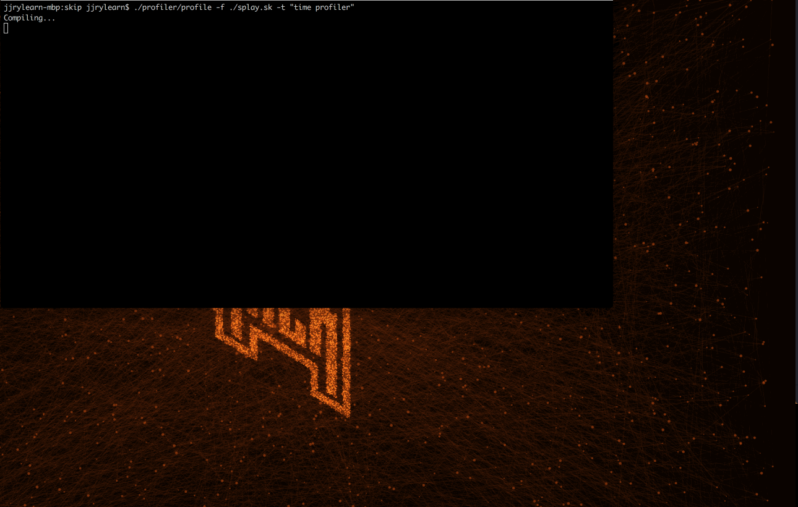

## Profiler that scripts the executing of the Instruments profiling tools.

### Command format (from root project directory)

profiler/profile -f [path_to_skip_program_file] -t ["name of tool" (i.e. "time profiler", "leaks", "allocations", etc.)] [-c]

example to profile the run of test.sk:
profiler/profiler -f ./test.sk -t "time profiler"

Example to profile the compilation of test.sk:
profiler/profiler -f ./test.sk -t "time profiler" -c

### Requirements

- Xcode Instruments
- Accessibility access enabled for your terminal program. To do this manually you can navigate to System Preference > Security & Privacy > Privacy > Accessibility > then add your terminal program to the list. If you don't do this manually then the profiler will navigate to this System Preferences window for you.

### Demo

